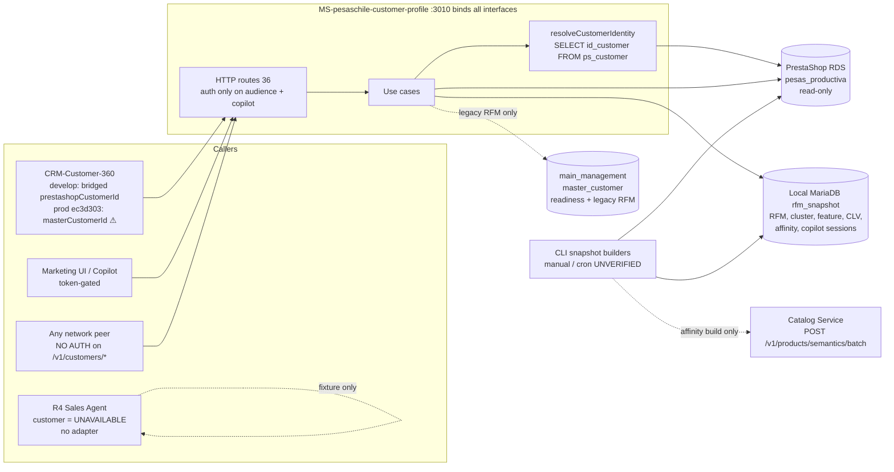
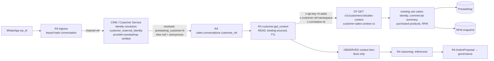
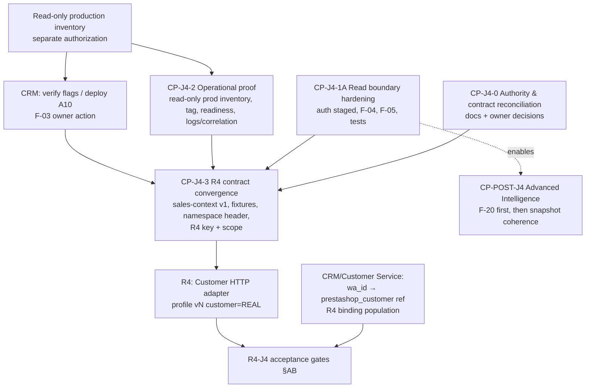

# CP-R4-J4 — Customer Profile Readiness & Architecture Audit

| Field | Value |
|---|---|
| Audit ID | CP-R4-J4 |
| Date | 2026-10-08 |
| Mode | Read-only repository audit. No implementation, migration, deployment, production access, commit or push. |
| Primary repository | `MS-pesaschile-customer-profile` @ `main` = `origin/main` = `23a2ef3` (2026-09-11) |
| Related repositories (read-only) | `R4-agent-platform` @ `main` `aa974b7` (2026-10-05); `CRM-Customer-360` @ `develop` `8298723` (2026-09-25), plus historical production commit `ec3d303` |
| Not inspected | `MS-pesaschile-catalog-service` (contract only, via Customer Profile consumer code and R4 docs); any production host |

> **Evidence rule:** every finding cites code at HEAD `23a2ef3`. Statements from historical documents are labelled as historical. Nothing in this report was verified against production. Anything that depends on deployed state is `UNVERIFIED`.

---

## A. Executive verdict

Customer Profile **has the factual data capabilities R4-J4 needs**, but they are **not yet a safe owner contract for an agent**:

- **Done and solid:**
  - PrestaShop-direct customer reads: profile, commercial summary, purchased products, purchase behavior and order status.
  - A typed `available / not_found / degraded` result model.
  - Parameterized SQL.
  - A primary RFM path keyed by `ps_customer.id_customer`.
  - A clean separation between the `customerId` and `masterCustomerId` route families.
- **Typecheck and lint pass.**
- **Tests:** 2,157 of 2,159 pass. One is skipped and one is a flaky timeout under parallel load that passes in isolation.
- **Every CP-R1 code blocker from earlier audits is fixed.**

What blocks R4-J4 is not missing analytics. It is the **boundary**:

1. **No authentication on any `/v1/customers/*` read.** Customer IDs are sequential, and the profile route returns name and email. The server binds every interface.
2. **No identity translation contract between R4 and Customer Profile.** R4 holds only an opaque `customerRef`, which is always `null` in production, plus a WhatsApp `wa_id`. Customer Profile accepts only `ps_customer.id_customer`. Nobody owns the step from `wa_id` to that ID for R4.
3. **A live cross-namespace hazard.** The CRM build last recorded in production (`ec3d303`) sends `masterCustomerId` to routes that now interpret the number as `ps_customer.id_customer`. If that client is enabled, it silently gets another customer's RFM, purchased products and purchase behavior.
4. **Guest and deleted PrestaShop accounts resolve as ordinary customers**, and nothing in the response discloses it.
5. **Five core endpoints report a PrestaShop outage as HTTP 500, not the typed 503 `degraded`.** I reproduced this in memory.
6. **No R4-facing contract artifact exists:** no versioned fixtures, freshness bounds, correlation-ID handling, PII-bounded projection or deployment proof.

Customer Intelligence (RFM enrichment, clusters, CLV, affinity, audiences) is **PARTIAL**. Each snapshot store is sound at write time, but reading several together has proven coherence and UNKNOWN-semantics defects. None of these blocks J4, because J4 needs at most an optional, degradable RFM projection.

```
CUSTOMER_PROFILE_CODE_READY=NO
CUSTOMER_PROFILE_OPERATIONAL_READY=UNVERIFIED
CUSTOMER_IDENTITY_CONTRACT_READY=NO
CUSTOMER_INTELLIGENCE_READY=PARTIAL
R4_J4_OWNER_CONTRACT_READY=NO
R4_J4_READY_TO_INTEGRATE=NO
R4_J4_CRITICAL_BLOCKERS=8
CUSTOMER_PROFILE_REMEDIATION_READY_TO_START=YES
```

**Recommended first implementation slice:** **CP-J4-1A, Customer read boundary hardening** (§AE). It adds service authentication with a staged enforcement mode, fixes the degraded-mapping defect, and discloses guest/deleted/inactive status. It is local to Customer Profile, additive, and runs in parallel with the CP-J4-0 identity decision record, which needs owner approval from CRM, Customer Profile and R4.

---

## B. Git baseline and provenance

### B.1 Checkout

| Item | Value |
|---|---|
| Root | `C:\Users\dell\Pesaschile IA\dev\MS-pesaschile-customer-profile` |
| Branch | `main` |
| HEAD | `23a2ef301a0ed987df0e97d8361ae173c58dd8d9`, 2026-09-11, "fix: isolate customer intelligence audience auth" |
| origin/main | Same SHA, as of the last local fetch. No fetch was performed. |
| Working tree at audit start | Clean |
| Tags / releases | **None.** There are no git tags, so there is no way to name a deployable version. |
| Unmerged remote branches | **None.** All 20 remote branches are ancestors of `main`, including `feat/customer-intelligence-clv-a07`, `feat/marketing-r1-t05-*` and `feat/copilot-openai-compatible-provider`. |
| Process note | The last PR merge is `ddf4847` (#22). The 28 commits after it, from 09-01 to 09-11, went straight to `main` with no PR. |
| Runtime | Node `v22.23.2` locally; `@types/node ^22`. TypeScript `^5.9.3`, ESM (`"type": "module"`), `tsx` for scripts. |
| Package manager | npm (`package-lock.json`) |
| Main scripts | `typecheck`, `lint`, `test` (vitest), `build`, `start` (`node dist/src/index.js`). There are 37 operational CLI scripts (`snapshot:*`, `cluster:*`, `analytics:*`, `clv:*`, `customer:affinity:*`, `customer:audience:validate`, `intelligence:*`). |
| Deployment artifacts in repo | **None.** No Dockerfile, compose file, PM2 ecosystem file, systemd unit or CI workflow. |

**Changes this audit made to the working tree:**
- Ran `npm ci --ignore-scripts`, which created `node_modules/` (gitignored).
- Added this document as an untracked file.

Nothing else changed.

### B.2 Chronological release map

| Date | Commit(s) | Release |
|---|---|---|
| 2026-07-27 | `acfcf61`, `1fce664` | CP-R1-T01 identity/schema audits; CP-R1-T02 master-customer link design, which introduced **migration 001** |
| 07-27 → 07-29 | PR#1–#10 | T03 runtime read foundation → T04 orders → T05 order-state context → T06 order status → T07 commercial summary → T08 purchased products → T09 product behavior |
| 07-29 → 08-06 | PR#11–#13 | T10A RFM population audit; T10B8A identity contract audit; T11A dataset; T11A4 monetary policy; **T12A: `customerId` becomes `ps_customer.id_customer` (breaking)** |
| 08-14 → 08-17 | `e76a799`, `638c6a5`, PR#14 `5e3d0d8` | T11B–T11G RFM runtime/scheduler/segmentation; T11H cross-repo pointer; T12B debt audit; T12D gates; **Track A production readiness** (A1A2, A3, A3B); EC2 runbook |
| 08-19 | PR#15/#16 | CP-R2 behavioral clustering (experiment, productionization, analytics) |
| 08-20 → 08-27 | PR#17–#21 and direct commits | CP-R3 analytics data layer and read model; MARKETING-R1 copilot (T01–T05.x); dashboard (T06.x) |
| 08-28 → 09-02 | PR#22 and direct commits | Product semantics moved to Catalog; CLV A00–A07; commercial profile A02; affinity A01.x; Customer Intelligence capability boundary; audience A01/A02 |
| 09-09 → 09-11 | direct commits | Catalog HTTP semantics wiring; affinity quantity evidence; audience A04.1–A04.5.1 export; audience auth isolation (HEAD) |

The core factual use cases have not changed since `a61b2b0` (2026-08-06): `get-customer-profile.ts` and `get-customer-commercial-summary.ts`. Later changes to `routes`, `bootstrap` and `config` were additive Customer Intelligence wiring.

### B.3 Historical blocker reconciliation

| ID | Finding | Status at HEAD | Evidence |
|---|---|---|---|
| TD-001 (P0) | `/health/ready` CRM slot fed by a PrestaShop ping | **RESOLVED AND VALIDATED** | `src/bootstrap.ts:484-490`; `tests/unit/bootstrap-readiness.test.ts`; A3B real `crm:false` |
| TD-002 | Local `main` behind origin | RESOLVED | HEAD = origin/main |
| TD-003 | `customerId`/`masterCustomerId` collision on `/rfm` | **RESOLVED AND VALIDATED in this repo** (see F-03 for consumer-side residue) | `src/http/routes/index.ts:863` vs `:902` |
| TD-004 | No external RFM scheduler | **STILL OPEN / UNVERIFIED** | Command exists (`scripts/snapshots/rfm-snapshot-scheduled.ts`); the cron line is a runbook template only |
| TD-005 | CRM-Customer-360 flags off | UNVERIFIED (cross-repo) | — |
| TD-006 | RFM infra failure → 500 | Primary path: RESOLVED IN CODE (`get-customer-rfm-by-customer-id.ts:30-42`). **Legacy path: STILL OPEN** (`get-customer-rfm.ts:20,32`) | — |
| TD-007 | Two RFM config schemas | STILL OPEN (low) | `src/config.ts:21-27` vs `src/rfm-snapshot-config.ts` |
| TD-008 | No real-DB RFM validation | RESOLVED AND VALIDATED **on a local Docker MariaDB** (A3B). Never validated on the production snapshot host. | A3B doc; RFM code changes since then are behavior-preserving |
| TD-011 | PII over-fetch for an existence check (legacy) | STILL OPEN | `src/infrastructure/crm/mysql-master-customer-reader.ts:7-12` |
| TD-012 | No RFM freshness/staleness signal | **STILL OPEN** | No freshness logic in `src/application/customer-rfm` |
| TD-013 | CRM coupling on legacy `/rfm` not-found branch | Primary: RESOLVED. Legacy: STILL OPEN | `get-customer-rfm.ts:32` |
| TD-014 | RFM keyed only by `masterCustomerId` | RESOLVED AND VALIDATED | `routes/index.ts:863` |
| **TD-015** | **Migration 001 alters CRM-owned `master_customer`** | **STILL OPEN, and superseded in principle** (see §G) | `migrations/001_*` still present; CRM chose `customer_external_identity` instead |
| TD-016 | RDS vs `127.0.0.1` CRM host discrepancy | UNVERIFIED | Infra |
| T12B §9 | No service-to-service auth | **STILL OPEN** for customer, intelligence, dashboard and clustering reads; RESOLVED for copilot and audience | `routes/index.ts:1521-1629` |
| T12B §13 | Doc drift | **STILL OPEN** | `README.md` still documents `/v1/customers/{masterCustomerId}/rfm` and only 8 routes, and says CRM is "not required" although `CRM_DB_*` is mandatory at boot |
| Gate 2 §3 | Server can't boot without RFM DB | RESOLVED IN CODE | `config.ts:21-25,154-174`; `bootstrap.ts:275-282` |
| A3 §7 | CRM resolver error aborted the snapshot | RESOLVED AND VALIDATED | `create-rfm-snapshot.ts` fail-open |
| T10B8A Case D | `masterCustomerId` equivalence not demonstrable | SUPERSEDED by T12A | — |
| T11A2 | RFM timezone `UNVERIFIED` | STILL OPEN (low) | `src/domain/customer-rfm/dataset.ts:172-173` |
| Separation audit | 13 duplicate ontology/classifier paths | RESOLVED (moved to Catalog) | — |
| Separation audit | `scripts/audits/product-intelligence-exploration/export-product-catalog.ts` reads PrestaShop products directly | STILL OPEN (deferred, script only) | — |

---

## C. Current architecture

### C.1 AS-IS



### C.2 Layering

| Layer | Content |
|---|---|
| Domain (`src/domain/*`) | 25 bounded modules, roughly: identity, profile, orders, order-status, commercial-summary, purchased-products, purchase-behavior, RFM, clustering, analytics features, CLV, affinity, commercial profile, intelligence read model, query, intersection, dashboard, audience, copilot, master-customer population, identity resolution, order classification |
| Application (`src/application/*`) | Use cases with injected ports. No SQL. |
| Infrastructure (`src/infrastructure/*`) | mysql2 readers and repositories behind a `QueryExecutor` seam (`src/infrastructure/shared/query-executor.ts`), one lazy pool per credential family, and the Catalog HTTP source |
| HTTP (`src/http/routes/index.ts`, 2,542 lines) | One monolithic router; zod parameter validation; typed status mapping |
| Composition (`src/bootstrap.ts`) | Optional capabilities wired all-or-nothing from config |

### C.3 Obsolete, duplicate or unreachable paths (not deleted)

| Path | Status |
|---|---|
| `GET /v1/master-customers/:masterCustomerId/rfm`, `src/application/customer-rfm/get-customer-rfm.ts`, `src/infrastructure/crm/mysql-master-customer-reader.ts` | Legacy. No known current caller: CRM `develop` uses the `customerId` route. Depends on an unapplied column. |
| `src/domain/identity-resolution/*`, `src/domain/master-customer-population/*` | Classifiers for the never-executed CP-R1-T02 population job. Unreachable from HTTP. |
| `migrations/001_*` | Unapplied design artifact against a CRM-owned table (§G) |
| `Bootstrap.resolveCustomerIdentity` export | Exported but unused by `src/index.ts` |
| `getCustomerCommercialAffinities`, `customerCommercialProfileService.getByCustomerIds` (batch) | Implemented; no HTTP route |
| `src/infrastructure/catalog-product-semantics/http-product-semantic-facts-source.ts` | Batch scripts only; never on the request path |

---

## D. Capability inventory

| Capability | Implemented | Tested | Snapshot-published | Contract-stable (versioned) | Operationally validated | Production deployed | Actively consumed |
|---|---|---|---|---|---|---|---|
| Customer identity (PrestaShop direct) | Yes | Yes | n/a (live) | `customer-profile-prestashop-direct-v1` | T12A live smoke (historical) | UNVERIFIED | CRM `develop` (deployment UNVERIFIED) |
| Profile | Yes | Yes | n/a | same | historical | UNVERIFIED | CRM `develop` |
| Order status | Yes | Yes | n/a | same | historical | UNVERIFIED | CRM `develop` |
| Commercial summary | Yes | Yes | n/a | same | historical | UNVERIFIED | CRM `develop` |
| Purchased products | Yes | Yes | n/a | same | historical | UNVERIFIED | CRM `develop` (prod `ec3d303` sends the wrong namespace) |
| Purchase behavior | Yes | Yes | n/a | same | historical | UNVERIFIED | same |
| RFM (customerId) | Yes | Yes | Yes (`customer_rfm_snapshot`) | `customer-rfm-runtime-v1` | A3B, local Docker MariaDB | UNVERIFIED | CRM `develop` |
| Feature snapshots | Yes | Yes (mocked) | Yes | `customer-analytics-features-v1` | Dry-run only | UNVERIFIED | Through intelligence, dashboard and audience |
| Behavioral clustering | Yes | Yes | Yes | runtime constant + model version | CP-R2-T02 live training (historical) | UNVERIFIED | Dashboard / audience |
| CLV | Yes | Partly (store untested) | Yes, no run lock | `customer-clv-runtime-v1` | Local only (A06) | UNVERIFIED | Intelligence, audience |
| Commercial affinity | Yes | Yes | Yes, no run lock | `customer-commercial-affinity-runtime-v1` | EC2 snapshot 4 (historical doc) | UNVERIFIED | Audience, commercial profile |
| Commercial profile (composite) | Yes | Yes | n/a (composition) | `customer-commercial-profile-v1` | None | UNVERIFIED | Unknown |
| Intelligence read model | Yes | Yes | n/a | `customer-intelligence-read-model-v1` | "deferred" | UNVERIFIED | Dashboard, copilot |
| Audience evaluate / preview / export | Yes | Yes (SQL null path untested) | n/a | `AUDIENCE_*_VERSION` | A04.5.1 EC2 rehearsal PASS (09-10, before the HEAD auth/flag change) | UNVERIFIED | CRM audience workspace (design) |
| Dashboard / copilot | Yes | Yes | n/a | versioned | Partial (copilot EC2 evidence in T05 doc) | UNVERIFIED | Marketing UI |

---

## E. Domain ownership matrix

| Data / table | Physical location | Owner | Customer Profile access | Assessment |
|---|---|---|---|---|
| `ps_customer`, `ps_orders`, `ps_order_detail`, `ps_order_state(_lang)`, `ps_carrier(_lang)`, `ps_product` | PrestaShop RDS `pesas_productiva` | PrestaShop (commerce system of record) | Read-only, parameterized | Correct |
| `master_customer` | `main_management` | **CRM / Customer Service** | Read: readiness probe (`crm-pool.ts:55`), legacy RFM (`mysql-master-customer-reader.ts:7-12`), snapshot enrichment (`mysql-rfm-canonical-identity-resolver.ts:77-83`). **Write: none in code. Migration 001 would ALTER it.** | **Ownership violation pending (F-12)** |
| `customer_external_identity` | `main_management` | CRM | **Not read** | This is where CRM keeps the PrestaShop ↔ master bridge. Customer Profile ignores it. |
| `customer_rfm_snapshot*` (002–004) | Local MariaDB `rfm_snapshot` | Customer Profile | Read/write | Correct |
| `customer_cluster_*` (005–007) | same schema | Customer Profile (CI) | Read/write | Correct; shares schema and credential with RFM |
| `customer_feature_snapshot*` (008–009) | same | Customer Profile (CI) | Read/write | Correct |
| `customer_intelligence_copilot_*` (010–011) | same | Customer Profile (Marketing copilot) | Read/write | Correct; 010 has no rollback |
| `customer_clv_snapshot*` (012) | same | Customer Profile (CI) | Read/write via the **RFM pool** | Credential sharing |
| `customer_commercial_affinity_snapshot*` (013–015) | same | Customer Profile (CI) | Read/write via the **RFM pool** | Credential sharing |
| Product ontology / semantics | Catalog Service | **Catalog** | Consumed by batch HTTP. Only lineage IDs and derived `affinity_axis`/`affinity_code` are persisted. | Correct, no competing ontology |
| Purchased product names / references | Order-line snapshot `ps_order_detail.product_name/reference` | PrestaShop (historical evidence) | Read | Correct as purchase evidence; **not** Catalog identity |
| Formal quotes | Quote Service | Quote | None | Correct |
| Agent context, strategy, actions | R4 | R4 | None | Correct |

---

## F. Customer identity model

### F.1 Identifier inventory

| Identifier | Namespace | Authority | Where it is used | Resolution | Not found | Unlinked | Failure |
|---|---|---|---|---|---|---|---|
| `customerId` (path, all `/v1/customers/:customerId/*`) | `ps_customer.id_customer` (INT) | PrestaShop | 12 routes | `SELECT id_customer FROM ps_customer WHERE id_customer=?` (`mysql-prestashop-customer-identity-repository.ts:17-22`) | 404 `customer_not_found` / `not_found` | n/a (no link concept) | Profile, summary, products, behavior, order status: **500** (F-04). RFM, cluster, commercial profile: 503. |
| `masterCustomerId` (path, `/v1/master-customers/:id/rfm`) | `master_customer.id` (BIGINT, string end-to-end) | CRM | 1 legacy route | RFM row by `master_customer_id`, then CRM lookup on miss | 404 | `rfm_not_available` | **500** (no try/catch, `get-customer-rfm.ts:20,32`) |
| `prestashopCustomerId` (internal) | = `customerId` | PrestaShop | Analytics tables (`prestashop_customer_id`), `getCustomerIntelligenceRow` | Direct key | Component null / `customer_not_in_feature_snapshot` | — | — |
| WhatsApp / channel identity | `wa_id` | Channel (Meta) | **Not accepted by Customer Profile** (README: "No email-, phone- or RUT-based lookup") | — | — | — | — |
| CRM customer reference | `master_customer.id` | CRM | Legacy route only | — | — | — | — |
| External identity link | CRM `customer_external_identity` (`provider='prestashop'`, `external_id`) | CRM | **Not read** | — | — | — | — |
| RUT | — | none | `profile.customer.rut` is always `null` (`get-customer-profile.ts:151`) | — | — | — | — |

Permissions: **none** on any of the above (§R).

### F.2 Conceptual scenarios

| Scenario | Current behavior | Safe? |
|---|---|---|
| Existing PrestaShop customer | `available` with provenance `DIRECT_SOURCE` | Yes |
| Existing CRM master customer passed to `/v1/customers/:id/*` | Treated as `ps_customer.id_customer`. Returns **whichever PrestaShop customer has that number**, or 404. | **NO. Silent wrong-customer read (F-03).** |
| CRM customer with no PrestaShop link | Customer Profile cannot be asked; the caller must not call it | Only safe if the caller enforces it |
| PrestaShop customer with no master record | `available`; RFM snapshot row has `master_customer_id = NULL` | Yes |
| Guest purchase (`ps_customer.is_guest = 1`) | Resolves as a normal customer. `is_guest` is never read (no match in `src/`). | **NO disclosure (F-05)** |
| Anonymous WhatsApp conversation | Not addressable. R4 sets `customerRef: null` and the capability is not registered in production. | Yes (fails closed) |
| Conflicting identity evidence | Not Customer Profile's concern. CRM reports conflicts in Customer Service and the resolver. | n/a; must stay with CRM |
| Deleted (`ps_customer.deleted = 1`) / inactive (`active = 0`) | Deleted: served with no indication. Inactive: served with warning `prestashop_customer_inactive` on the profile route only (`get-customer-profile.ts:138-140`). | **Deleted is not disclosed (F-05)** |
| Duplicate / colliding numeric IDs | `master_customer.id` and `ps_customer.id_customer` are both positive integers and overlap. The routes are prefix-separated in Customer Profile, but a caller that formats the wrong ID into `/v1/customers/` is undetectable. | **NO namespace assertion on the wire (F-03)** |

### F.3 Recommendation: canonical customer reference for R4-J4

1. **The canonical reference R4 uses in J4 is a namespaced string: `prestashop_customer:<id_customer>`.** It is stored in `sales.conversations.customer_ref` (R4 `agents/sales/migrations/0006_*:12-20`). It is the only namespace every Customer Profile factual and analytical surface already keys on.
2. **R4 never derives it.** R4 must not infer it from phone, email or `wa_id`, and Customer Profile must not either. The identity owner, CRM / Customer Service, issues it from a verified link: `customer_external_identity` with `provider='prestashop'` and `is_verified=1`, written by CRM `link_prestashop_identity` (ID-R2-A09).
3. **Translation contract, owned by CRM/Customer Service and not built in Customer Profile:**
   - Input: `{ channel: 'whatsapp', accountRef, conversationRef }`, or the CRM's existing resolution handle.
   - Output: `{ status: 'resolved' | 'unresolved' | 'ambiguous' | 'conflicted', customerRef?: 'prestashop_customer:<id>', assurance: 'verified' | 'provisional', resolvedAt }`.
   - Anything other than `resolved` leaves R4's `customerRef` null, and the customer stays anonymous.
4. **Customer Profile enforces the namespace on the wire** for the R4 contract, through an explicit `customerRef` with a namespace prefix (§V). A bare number from a new consumer is never accepted.
5. `masterCustomerId` is **not** a J4 reference. The legacy route stays isolated (§Z).

> **Stop condition (§25):** choosing the identity authority, and whether R4 may treat a CRM-verified link as `provisional` or `verified` assurance, is a canonical-identity decision for the CRM, Customer Profile and R4 owners. This audit recommends; it does not decide.

---

## G. Identity collisions and migration ownership

### G.1 Migration 001: current status

- **File:** `migrations/001_add_master_customer_prestashop_customer_id.sql`.
  - Adds `master_customer.prestashop_customer_id INT UNSIGNED NULL` with a UNIQUE key.
  - Header: "Runs against main_management. Not executed yet — design artifact only."
  - Not idempotent: no `IF NOT EXISTS`.
  - Single commit `1fce664` (2026-07-27). No apply script references it.
- **CRM-Customer-360** `develop` owns `master_customer` (CRM migration `006`).
  - Its migrations 001–036 **never add this column**.
  - Its owner audit `docs/audits/SALES-AGENT-R2-CP-R2-A01-customer-profile-identity-integration-audit.md` (2026-08-24) rejected the column as a canonical source and chose `customer_external_identity` as the bridge.
- **Live evidence:** historical Gate 2 got `ER_BAD_FIELD_ERROR`, so the column was absent at that time. Current production state is UNVERIFIED.
- **Classification: STILL OPEN; superseded in principle.** Customer Profile code still targets the column:
  - The readiness probe (`src/infrastructure/crm/crm-pool.ts:55`), which therefore reports `crm:false` permanently.
  - The legacy route reader (`mysql-master-customer-reader.ts:7-12`).
  - The RFM snapshot enrichment (`mysql-rfm-canonical-identity-resolver.ts:77-83`, fail-open).
  - The hard-coded `canonicalIdentitySource: 'master_customer.prestashop_customer_id'` (`src/domain/customer-rfm/dataset.ts:217`).
- **Customer Profile does not mutate CRM tables in code.** The violation is latent, existing only in the migration artifact.

**Recommendation:** with CRM owner approval, retire migration 001 by marking it `SUPERSEDED`, not deleting it. Then either repoint the RFM enrichment at `customer_external_identity` read-only, or drop the enrichment. Remove the CRM column probe from readiness. Do **not** apply 001 anywhere.

### G.2 Active cross-namespace hazard (F-03)

In CRM `ec3d303`, the last commit recorded as deployed on EC2 per CRM doc `SALES-AGENT-R2-ID-R2-A11.2:20` (2026-08-26):

- `lib/integrations/customer-profile/http-client.ts:590` calls `v1/customers/${masterCustomerId}/rfm`.
- `lib/customer-profile/httpCustomerProfileAdapter.ts:442,454` call `/v1/customers/${masterCustomerId}/purchased-products` and `/purchase-behavior`.

Since T12A (2026-08-06) and Track A A1A2 (2026-08-17), Customer Profile interprets that number as `ps_customer.id_customer`. Both calls are gated by `CUSTOMER_PROFILE_ENABLED` / `CUSTOMER_PROFILE_CONTEXT_ENABLED`, which default to `false`. **If either flag is `true` in production, CRM silently receives another customer's data.**

CRM `develop` fixed this in ID-R2-A10 (`94755bd`, sending the bridged `prestashopCustomerId`). Whether that fix is deployed is UNVERIFIED.

---

## H. HTTP contract matrix

36 routes, all registered in `src/http/routes/index.ts`. App-level middleware is only `express.json()` (`src/app.ts:8`). There is no global auth, no request-ID middleware, and no rate limit except on audience export.

### H.1 Routes relevant to J4

| Method / path (line) | Input (runtime schema) | Identity | Output (status codes) | Auth | Provenance | Freshness | Errors | Readiness dependency | Tests | Known consumer | Status |
|---|---|---|---|---|---|---|---|---|---|---|---|
| `GET /v1/customers/:customerId/profile` (709) | `numericId` 1–20 digits, >0 (`:97-102`, `:1550-1556`) | `ps_customer.id_customer` | 200 `available` {profile: name, **email**, `rut=null`, prestashop flags, ≤`CUSTOMER_PROFILE_RECENT_ORDERS_LIMIT` recent orders, warnings} / 404 / 503 / 500 | **None** | `provenance.{customerIdentity, dataSources, generatedAt, contractVersion}` | Live read | 400 `invalid_customer_id`, 500 `internal_error` (F-04) | PrestaShop | unit + integration (stubbed) | CRM | Implemented; deployment UNVERIFIED |
| `GET /v1/customers/:customerId/commercial-summary` (738) | no query or body allowed | same | 200 {totalOrders, totalSpentTaxIncl, AOV, first/last order, daysSince, frequencyDays, units, distinct products, cancelled/refunded counts, CLP} / 404 / 503 / **500** | None | yes | Live | same | PrestaShop | yes | CRM | same |
| `GET /v1/customers/:customerId/purchased-products` (774) | `limit` 1–100 (default 20), `offset` ≥0 | same | 200 {products[productId, productAttributeId, name, reference, qty, orderCount, first/last, spent, catalogStatus], pagination} / 404 / 503 / **500** | None | yes | Live | `invalid_limit`, `invalid_offset` | PrestaShop | yes | CRM | same |
| `GET /v1/customers/:customerId/purchase-behavior` (816) | `topProducts`, `topVariants` 1–10 | same | 200 {summary, concentration, topProducts, topVariants} / 404 / 503 / **500** | None | yes | Live | — | PrestaShop | yes | CRM | same |
| `GET /v1/customers/:customerId/orders/:reference/status` (1409) | reference alphanumeric ≤32 | same; ownership enforced in SQL (`WHERE id_customer=? AND reference=?`) | 200 / 404 `customer_not_found`/`order_not_found` / 503 / **500** | None | — | Live | `invalid_order_reference` | PrestaShop | yes | CRM | same |
| `GET /v1/customers/:customerId/rfm` (863) | none | same | 200 {snapshot{id, calculationVersion, referenceTime, publishedAt, currency}, rfm, segment} / 404 `customer_not_found` or `rfm_not_available` / 503 `degraded` (`rfm_not_configured`, `rfm_unavailable`, `no_published_rfm_snapshot`) | None | snapshot lineage | Snapshot; **no staleness flag** | typed | RFM DB (not in readiness) | yes | CRM `develop` | same |
| `GET /v1/customers/:customerId/commercial-profile` (1110) | none | same | 200 {rfm, cluster, clv, affinity, `availability` AVAILABLE / NOT_IN_POPULATION / UNAVAILABLE, per-component provenance, oldest/newest referenceTime} / 404 / 503 | None | per component | Independent "latest" snapshots | typed | optional DBs | yes | unknown | same |
| `GET /health`, `GET /health/ready` (265, 269) | — | — | ready = PrestaShop schema probe; `crm` informational | None | `contractVersion` | — | 503 `not_ready` | PrestaShop | yes | ops | same |

### H.2 Other route families

| Family | Routes | Auth | J4 relevance |
|---|---|---|---|
| Legacy RFM | `GET /v1/master-customers/:masterCustomerId/rfm` (902) | None | **Exclude**; candidate REMOVE after consumer verification |
| Customer Intelligence per customer | `/cluster` (939), `/clv` (974), `/affinity` (1004), `/intelligence` (1081) | None | Optional / Target B |
| Snapshot metadata | `/v1/customer-commercial-affinity/snapshot` (1033), `/v1/clv/snapshot` (1057), `/v1/clustering/snapshots/{latest,:id}/…` (1156, 1186, 1216) | None | No |
| Dashboard | `/v1/customer-intelligence/dashboard/{context,overview,rfm,clusters}` GET, `/intersections` POST (1255–1378) | **None** (POST runs analytical queries) | No |
| Audience | `/audiences/schema`, `/evaluate`, `/export` (294, 307, 329) | `x-internal-customer-intelligence-token`; export token or Bearer; separate PII token; default disabled → 404 | No (marketing) |
| Copilot | `/copilot` + 8 `/copilot/sessions/*` (481–670) | `x-internal-copilot-token` | No |

**Route generations and compatibility obligations:**
- (1) Pre-T12A, `/v1/customers/:masterCustomerId/*`: retired by a breaking change. Its residue is F-03.
- (2) Current, `customerId = ps id`.
- (3) `/v1/master-customers/...`, legacy.

Do **not** add a parallel `/v2/customers/*` copy of the existing routes. The only new route justified by evidence is the bounded R4 projection (§V).

---

## I. Commercial summary and purchased products

| Aspect | Commercial summary | Purchased products | Purchase behavior |
|---|---|---|---|
| Order eligibility | `valid = 1` for totals and dates (`mysql-commercial-orders-summary-reader.ts:33-39`) | `o.valid = 1` (`mysql-purchased-products-reader.ts:63-64`) | `o.valid = 1` |
| Monetary | `SUM(total_paid_tax_incl)`: IVA, shipping and discounts included, seller-service included, no `>0` filter | Line `total_price_tax_incl` | Line level |
| Cancellations / refunds | Counted separately with **hard-coded `current_state = 6` / `7`** (`:40-43`), the PrestaShop default IDs. Not validated against PesasChile's state catalog in code. | **Not subtracted.** `product_quantity_refunded`, `product_quantity_return` and `total_refunded_tax_incl` are not read, although RFM and CLV readers do read them. | Not subtracted |
| Variant identity | — | `(product_id, product_attribute_id)` | same |
| Catalog link | — | `catalogStatus` = `ps_product` row exists. **No Catalog `itemKey`.** | none |
| Name / reference | — | Latest order-line snapshot, historical text | same |
| Pagination | — | Deterministic `ORDER BY last_purchased_at DESC, product_id DESC, attribute DESC`, `LIMIT/OFFSET`, `hasMore` | Top-N ≤10 |
| Freshness | Live; `generatedAt` | Live | Live, `calculatedAt` |
| Null semantics | Zero orders → nulls for dates, validated (`:78-86`) | Empty list | `distinctProductCount = 0` |

**Purchase is not ownership.** A purchased-products row proves that a valid order line existed. It does **not** prove current possession: returns and refunds are not netted, there is no warranty or installed-base concept, and nothing infers equipment from accessories.

**What is safe for R4 to expose as a customer fact:**
- "Customer bought `<product name at time of purchase>` (variant X), N units across M valid orders, first/last purchase dates", labelled `semantics: "purchased_historically"`.
- **Not safe as fact:** "customer owns X", "customer's installed base", "customer needs accessory Y". Those are R4 inferences (§17).

**Catalog compatibility:**
- R4 J1 uses Catalog `itemKey`. Customer Profile emits PrestaShop `productId/productAttributeId`.
- The minimum J4 requirement is that **R4 maps `(productId, productAttributeId)` to Catalog through Catalog's own lookup**, or that Customer Profile passes the IDs through unchanged and labelled with their namespace (`prestashop_product`). Customer Profile must not mint itemKeys.
- CAT-V2 convergence is not a J4 prerequisite.

---

## J. RFM readiness

| Topic | Finding |
|---|---|
| Population | `active-365-valid-prestashop-customer-v2` (`src/domain/customer-rfm/dataset.ts:45`): customers with ≥1 valid order (`valid=1 AND total_paid>0`) in a 365-day window before `reference_time` |
| Monetary | Approved T11A4 policy: `total_paid_tax_incl − seller-service`, floored at 0; refunds not netted, by policy |
| Identity | `prestashop_customer_id` primary key; `master_customer_id` nullable enrichment (fail-open) |
| Versioning | `calculation_version`, population, monetary, refund, scoring, identity-authority versions, `segment_version` per row, `dataset_checksum` (migration 002/003) |
| Builder / publication | `snapshot:rfm` (manual) and `snapshot:rfm:scheduled` (UTC start of day, DB lock, run log `customer_rfm_snapshot_run`). States: building → validated → published / failed / superseded. |
| Scheduler | **Not in repo.** The cron line is a runbook template. Installation is UNVERIFIED (TD-004). |
| Retention | Unbounded; no purge |
| Runtime "current" | `WHERE status='published' ORDER BY published_at DESC, id DESC LIMIT 1` (`mysql-rfm-snapshot-reader.ts:51-68`). It is **not filtered by `calculation_version` or stream**, so if two streams are published, the newest `published_at` wins (F-17). |
| Missing-state semantics | **Customer does not exist** → 404 `customer_not_found`. **Exists but has no row in the current snapshot** (no purchase in 365 days, excluded operational account, or not yet computed) → 404 `rfm_not_available/no_current_rfm_record`; these three causes are **conflated**. **No published snapshot** → 503 `no_published_rfm_snapshot`. **DB not configured** → 503 `rfm_not_configured`. **DB error** → 503 `rfm_unavailable`. |
| Freshness | `referenceTime` and `publishedAt` returned, but **no age, max-age or `stale` flag** (TD-012). Readiness ignores RFM. |
| Historical evidence | A3B validated snapshot 3 (14,109 rows) on a **local Docker MariaDB**, and RFM code is materially unchanged since then. Production snapshot host and cadence are UNVERIFIED. |

**What J4 needs:** only a bounded, optional projection:
- `segmentCode` and `segmentVersion`, plus optionally `recencyDays` / `frequencyOrders`;
- `snapshot.referenceTime`, an age, and a staleness verdict;
- an explicit `availability` of `AVAILABLE`, `NOT_IN_POPULATION`, `UNAVAILABLE` or `STALE`.

Raw scores and monetary values are not needed by the Sales Agent. An RFM failure **must degrade, not block**, the factual context.

---

## K. Customer Intelligence: feature snapshot readiness

- **Implemented, tested (mocked pools), versioned** (`customer-analytics-features-v1`).
- Population `customer-analytics-population-b-v1` (≥1 valid order, operational accounts excluded).
- **Publication:** `analytics:snapshot`, single transaction with a checksum re-read, GET_LOCK plus UNIQUE key, run table.
- **Validation:** dry-run only; publish/idempotency "deferred to EC2" (CP-R3-T01 doc). Operationally **UNVERIFIED**.
- **Defect (F-21):** at-or-before composition only sees `status='published'` snapshots. Because supersession keeps one published row per stream, an RFM/cluster/CLV/affinity snapshot newer than the feature anchor makes that component **resolve to null even when an older compatible snapshot exists**. RFM runs on a scheduler; features are manual only (migration 009 `ENUM('manual')`). So every scheduled RFM run after a feature snapshot can null RFM in `/intelligence`, the dashboard, the copilot and audiences. Actual cadence is UNVERIFIED.
- **Defect (F-22):** the `/intelligence` resolver pins RFM and cluster at-or-before the feature reference time, but takes the **active** CLV snapshot (`resolve-customer-intelligence-context.ts:49-51` vs `:55-56`). The audience resolver pins all five components, so for one feature anchor, `/intelligence` and `/audiences/evaluate` can disagree on CLV. This is disclosed through `clvReferenceTime` but not enforced, and untested.

## L. Behavioral clustering

- Implemented (TypeScript serving; Python offline training), tested.
- Population ≥2 valid orders. GET_LOCK publication.
- Live training run documented in CP-R2-T02 (2026-08-19, n=10,147).
- **Defects:**
  - Interpretation labels are taken "latest by id" and are mutable through upsert. Cluster profiles (migration 007) are upserted non-transactionally after publish, so **historical reads can change labels** (F-27).
  - `cluster_not_available` asserts the reason `insufficient_repeat_purchase_history` for any absence (`get-customer-cluster.ts:55-63`).
- **J4: not required.** Labels are analytical inferences, not facts.

## M. CLV

- Implemented: two-stage cohort model `customer-clv-two-stage-cohort-v1`, 12-month horizon, CLP only. Contract `customer-clv-runtime-v1`.
- **The persisted run is documented locally only** (A06: snapshot 1, 45,194 rows).
- **No run lock or run table** (UNIQUE key only, F-24).
- The snapshot store (`src/infrastructure/clv/mysql-customer-clv-snapshot-store.ts`) has **no unit test**.
- Malformed-snapshot detection is a regex on error text (`get-customer-clv.ts:165`).
- `/clv` returns 504 on timeout and 500 on a malformed snapshot.
- **J4: exclude.** A forecast is an inference, and exposing CLV to a sales agent invites value-based discrimination of service. That is a policy decision for the owner.

## N. Commercial affinity

- Implemented. Catalog-semantics lineage is persisted, and the population membership table exists (014).
- EC2 snapshot 4 is validated in the A01.5.1 doc (historical). The later quantity-evidence change (`72ce26a`, 09-10) states "operational validation required".
- **Defects:**
  - **Wrong availability:** the runtime reports `NOT_IN_POPULATION` whenever the customer has 0 rows (`get-customer-commercial-affinity.ts:84`). That includes ~1,913 eligible customers with no affinity (A01.5.1). `isCustomerInAffinityPopulation` exists in the store but is never called. The audience path uses membership correctly, so the two paths disagree (F-23).
  - **Header/rows race:** the header is read first, then rows are read through a subquery that re-resolves the active snapshot (F-25).
  - No run lock (F-24).
  - A `validated`-but-never-published snapshot is reported as `skipped_existing` (F-26).
  - The atomic path's `recordFailure` is a no-op after rollback.
  - The Catalog ontology is not pinned to `referenceTime`, so a back-dated snapshot uses today's ontology (F-29).
- **J4: exclude.** Affinity is an inference ("likely interested in"), which R4 must treat as a hint at most (§17). It belongs to Target B.

## O. Audience capability

- Evaluate, preview and export (CSV/XLSX) are implemented with separate tokens for evaluate, export and PII export. All are default-disabled.
- The A04.5.1 EC2 rehearsal passed (2026-09-10). `23a2ef3` then re-gated schema/evaluate behind `CUSTOMER_INTELLIGENCE_AUDIENCE_ENABLED` and a new token. **A redeploy without those settings silently disables the routes (404)** (F-34).
- **Defect (P1, Target B):** SQL evaluation collapses UNKNOWN into FALSE when the component row exists but the field is NULL. `CASE WHEN <predicate> THEN 1 ELSE 0 END` (`compile-audience-sql.ts:49`) yields 0 for a NULL predicate, while the domain evaluator yields `UNKNOWN` (`logic.ts`). Under `NOT`, this **adds** customers wrongly; for example, `NOT(purchaseFrequencyDays > 30)` includes every single-order customer. SQL is authoritative for membership and export, so **exported audiences can contain wrong members** (F-20).
- HTTP evaluate and export cannot pin `featureSnapshotId`, so a publish between preview and download changes lineage. This is disclosed but not checked (F-30).
- **J4: not applicable.** Audience must never be exposed to R4.

---

## P. Catalog dependency

| Question | Answer |
|---|---|
| Does Customer Profile call Catalog? | Yes, **batch scripts only** (`scripts/customer-commercial-affinity/lib/semantic-source.ts`). No request-path code instantiates the HTTP source. |
| Endpoint | `POST {CATALOG_SERVICE_BASE_URL}/v1/products/semantics/batch`, ≤500 IDs (`http-product-semantic-facts-source.ts:110`; `batch-contract.ts:4`) |
| Purpose | Product semantic facts for commercial affinity |
| Auth | `x-api-key`, plus `x-correlation-id` |
| Timeout / retry | 2,500 ms; 2 retries, linear 100 ms backoff. Retries timeouts, network errors, 503 and 5xx. No retry on 401/403/409/malformed. |
| Deprecated API? | No evidence. R4 J1 audit `CAT-SE-02` notes the *reverse* coupling (Catalog search v2 calling Customer Profile), marked REMOVE for R4. |
| Semantics copied? | No. Only lineage IDs and hashes, plus derived `affinity_axis`/`affinity_code`. |
| Version pin | Within a run: `expectedSnapshotId` pinned after the first batch, and ontology/classifier/checksum must match. **Across runs: not pinned; no configurable expected snapshot.** |
| Failure | Build throws; nothing persisted (correct) |
| Shared key | Historical R4 doc `R4-J1D_PRODUCTION_CATALOG_CLOSURE.md:466,484,557` says customer-profile shares **one API key (identical hash) with CRM and Catalog** on the same host. This is a least-privilege issue for Catalog's owner (F-35, UNVERIFIED now). |

**Minimum J4 requirement against CAT-V2:** none on the Customer Profile side. J4's factual contract carries PrestaShop product IDs with a namespace label. Any `itemKey` mapping is a Catalog-owned lookup performed by R4's Catalog adapter. Pending Catalog V2 work is **not** a J4 prerequisite.

---

## Q. Snapshot lineage and freshness

| Property | RFM | Feature | Cluster | CLV | Affinity |
|---|---|---|---|---|---|
| Identity / key | `snapshot_key` unique | key without checksum | key without checksum | key + model checksum | key **with** `dataset_checksum` |
| Reference time | yes | yes | yes | defaults to `MAX(valid order date)` | required |
| Version | calc + 5 policies | `feature_version` | model / feature / preprocessing | model + 10 policies | calc + semantic lineage |
| Source checksum | `dataset_checksum` | source + feature | dataset + assignment | input/output (manifest) | dataset / population / semantic |
| States | building → validated → published / failed / superseded (all) | | | | |
| Active pointer | Implicit `published_at DESC` (all). The intelligence and audience header readers use `reference_time DESC`, which is **two incompatible orderings** (F-28). | | | | |
| `published_at` | = `generated_at`, not commit time, so a backfill with an older `reference_time` becomes "latest" **and supersedes the newer one** (no reference-time guard) (F-28) | | | | |
| Concurrency | lock + UNIQUE | lock + UNIQUE | lock + UNIQUE | **UNIQUE only** | **UNIQUE only** |
| Drift on rerun | skip | skip | skip | throws | **new key, silently supersedes** |
| Retention | none (all) | | | | |

Point-in-time caveat: every builder filters orders by *current* `valid`, not validity as of `reference_time`. History cannot be reproduced exactly after later state changes. This is acceptable if documented; it is not a J4 issue.

**Coherence summary:**
- **Audience:** coherent, pinned at-or-before.
- **Intelligence, dashboard, copilot:** RFM and cluster pinned, CLV unpinned.
- **Commercial profile:** four independent "latest" lookups, honestly disclosed as `oldestReferenceTime` / `newestReferenceTime`.

**Recommendation:** no component should present independently selected snapshots as one synchronized view. The J4 projection exposes RFM alone, with its own `referenceTime`, so the problem does not arise for J4.

---

## R. Authentication, PII and security

| Control | State | Evidence |
|---|---|---|
| Service-to-service auth on customer reads | **Absent** | No guard on `routes/index.ts:709-1450`; README:100 "any auth must be enforced upstream" |
| Network binding | All interfaces | `src/index.ts:83` `app.listen(config.port)` with no host |
| Principal separation | Only audience, export, PII export and copilot have distinct tokens (`:1558-1629`, timing-safe compare) | — |
| Least privilege for R4 | Not possible today: any caller reaching the port gets full profile PII | — |
| PII in responses | Profile: firstname, lastname, **email** (`get-customer-profile.ts:147-153`). No phone, address or RUT anywhere (RUT is always null). Order status: no PII. | — |
| Enumeration | Sequential `id_customer`; no rate limit | — |
| SQL injection | Parameterized `?` everywhere. The table prefix is validated by regex (`config.ts:122-126`) and re-asserted; `LIMIT` is validated before interpolation. | Low risk |
| Error serialization | Generic `{error:'internal_error'}`; logs carry `errorType` classification only (`src/observability/classify-error-for-log.ts`) | Good |
| Log PII | Logs include `customerId` and status, never names or emails (verified in the route log helpers) | Good |
| Token leakage | Tokens compared, never logged; Catalog key never logged | Good |
| Analytics / preview PII | Audience preview and export: PII fields only with the separate PII token | Good |
| Secret config | `.env` via dotenv; secret storage on EC2 UNVERIFIED | — |
| Credential sharing | One `RFM_SNAPSHOT_DB_USER` for the CLI writer, HTTP reader, CLV and affinity; Catalog key shared across services (historical) | F-35 |

**Could R4 retrieve more customer data than it needs?** Yes:
- The profile route returns name, email and the last N orders with monetary totals.
- `/commercial-profile` exposes CLV and affinity.
- Nothing restricts R4 to a purpose.

**Recommendation:** add a purpose-bound projection (§V) under a dedicated R4 principal whose scope cannot read `/profile`, `/clv`, `/affinity` or `/intelligence`. Whether R4 may receive `displayName` and contact data at all is an **owner privacy decision**. R4's own evaluation layer already redacts `email/phone/rut/address` (R4 `agents/sales/src/evaluations/definition.ts:53-54`).

---

## S. Runtime configuration

| Item | Finding |
|---|---|
| Schema | Zod (`src/config.ts`), fail-fast at import |
| Required | `CRM_DB_*`, `PRESTASHOP_DB_*`, `PRESTASHOP_ORDER_STATE_LANG_ID`, `PRESTASHOP_CARRIER_LANG_ID`, `PRESTASHOP_CARRIER_SHOP_ID` |
| **CRM required at boot** | `config.ts:9-15` requires `CRM_DB_*`, although J4 paths never use CRM and the README says CRM is "not required" (F-14) |
| Optional families | RFM, cluster and analytics DBs, all-or-nothing; Catalog pair all-or-nothing |
| **`.env.example` trap** | Copying `.env.example` verbatim (empty `KEY=` values) **fails boot**. Verified by an offline probe: 17 variables, from `RFM_SNAPSHOT_DB_*` through `CATALOG_SERVICE_API_KEY`, reject `''` because only `CUSTOMER_INTELLIGENCE_AUDIENCE_TOKEN` maps `''` to undefined. Operators must delete the lines (F-33). This fails closed, but it is a trap. |
| Pools | Lazy singletons per family; per-query `timeout` (default 3,000 ms); **no `connectTimeout`** (mysql2 default 10 s) |
| Readiness | PrestaShop schema probe (no query timeout); CRM column probe is informational; **RFM, analytics and cluster are not reflected** |

---

## T. Deployment and operational readiness

| Dimension | Status | Basis |
|---|---|---|
| Code-ready | NO for J4 (F-01 to F-07) | This audit |
| Configured | UNVERIFIED | No production env evidence |
| Reachable | UNVERIFIED | — |
| Healthy | UNVERIFIED | — |
| Deployed | UNVERIFIED | No doc records the deployed commit, host, URL or supervisor. T05 doc hints at PM2. The runbook leaves the supervisor unspecified. |
| Productively consumed | UNVERIFIED | CRM `ec3d303` has the clients but they are flag-gated (default off); CRM `develop` A10 is not proven deployed |

**Operational controls:**

| Control | State |
|---|---|
| `/health` and `/health/ready` | Present. Readiness has no timeout and does not cover optional capabilities. |
| Graceful shutdown | `server.close` then close all pools (`src/index.ts`). No forced timeout on keep-alive connections. |
| Retry / backoff | None on reads, which is correct (the caller decides). Catalog batch: 2 retries. |
| Metrics | **None** (no `/metrics`, counters or latency histograms) |
| Logs | `console.info(object, msg)`, which prints `util.inspect` text, **not JSON lines** (seen in test output). Not machine-parseable. |
| Correlation | Server-generated `requestId` on profile and order-status logs only; **no inbound `x-correlation-id` handling, nothing echoed** |
| Scheduler / worker | None in the process. CLI scripts are triggered externally; installation UNVERIFIED. |
| Migrations | Manual `mariadb < file` for 002–011; `clv:migrate` / `customer:affinity:migrate` for 012–015; 010 has no rollback. The runbook covers only 002–004. |
| Backup / restore | **Not documented** for `rfm_snapshot` (which holds copilot sessions and all snapshots) |

---

## U. Performance and scalability

Estimates from code. No benchmarks were run or invented.

| Call | DB round-trips | Notes |
|---|---|---|
| profile | 4 PrestaShop (identity, customer, orders, states) | Identity and customer read the same row twice |
| commercial-summary | 3 (identity + 2 aggregates) | Aggregates scan the customer's orders (indexed by `id_customer` in stock PrestaShop; production index UNVERIFIED) |
| purchased-products | 2 (identity + CTE with `ROW_NUMBER()` over every line of the customer) | Fine per customer; OFFSET paging degrades only for very large histories |
| purchase-behavior | 3 | — |
| rfm | 2 snapshot DB (+1 PrestaShop on miss) | The header query runs on **every** request; uncached |
| commercial-profile | identity + 4 components, each re-resolving identity → up to ~10 queries across 2 DBs | Redundant identity lookups |

**R4 per-turn cost:** with R4's freshness TTL of 60 minutes for `customer.get_context` (R4 `agents/sales/src/capabilities/customer.ts:33-36`), context should load **once per conversation window, not per turn**. Composing the J4 projection from existing use cases costs about 6–8 queries per load.

- PrestaShop pool `connectionLimit` defaults to 5, shared with every other route.
- **Timeout mismatch:**
  - R4 per-call deadline: 100–10,000 ms. R4 capability timeout: 10 s.
  - Customer Profile query timeout: 3 s each, but **sequential** inside a use case.
  - mysql2 connect timeout: 10 s default.
  - So a cold, unreachable PrestaShop can exceed R4's deadline. The J4 slice should set `connectTimeout` and an overall request budget.
- **Unbounded endpoints:** none on J4 routes; all are bounded (limit ≤100, top-N ≤10, recent orders ≤50).
- **Caching opportunity:** RFM header (seconds-level TTL); not needed for J4 v1.

---

## V. R4-J4 minimum integration contract

### V.1 Options

| Option | Description | Assessment |
|---|---|---|
| A. Reuse existing endpoints | R4 adapter calls `commercial-summary` + `purchased-products` + optional `rfm` (3 calls) | No Customer Profile code, but: no auth scope possible per route family without new code; 3× identity resolution; no freshness bounds; the RFM 404 conflation leaks into R4; `/profile` would be needed for any display name, bringing email and orders. Acceptable **only** as an interim v0 if B is rejected, and never including `/profile`. |
| **B. Bounded projection (recommended)** | One read `GET /v1/customers/{customerId}/sales-context`, composed **only from existing use cases** (identity, commercial summary, purchased-products page, RFM by customerId), versioned `customer-sales-context-v1` | One identity resolution, one auth scope, explicit freshness and degradation, no new data logic, no PII by default. **Not** a "giant endpoint": no CLV, affinity, cluster or audience. |

### V.2 Contract (Option B)

| Element | Definition |
|---|---|
| Caller identity | Dedicated principal `r4-sales`. Header `x-api-key: <R4 key>` (R4 Catalog adapter convention, `adapters/domains/catalog/http/src/adapter.ts:114-115`). The key is distinct from CRM's and Catalog's. Scope `customer.sales_context.read` only. |
| Customer identity | Path `customerId` = `ps_customer.id_customer`. **Required** header `x-customer-ref-namespace: prestashop_customer`; a missing or other value returns 400 `unsupported_customer_ref_namespace`. The response echoes `customerRef`. |
| Request | `GET /v1/customers/{customerId}/sales-context?purchasedProductsLimit=20` (1–50). No body; unknown params return 400. |
| Correlation | Inbound `x-correlation-id` (≤128, `[A-Za-z0-9._:-]`) is logged and echoed; generated if absent |
| Timeout | Server budget 2,500 ms total. R4 adapter deadline 3,000 ms. |
| Retryability | Idempotent GET. Retry only on 503/504 per R4 policy; R4 read capabilities use `maxAttempts: 1`. |
| Freshness | `observedAt`; `validUntil = observedAt + 15 min` for live facts; RFM carries its own `referenceTime`, `ageHours` and `stale` (>36 h after the expected daily snapshot) |
| PII | Default: **none**. `displayName` (first name only) only if the owner approves, under a separate scope `customer.sales_context.display_name`. Never email, phone, address or RUT. |
| Unknown / unlinked | Not resolvable by Customer Profile. R4 must not call without a `customerRef`. An unknown ID returns 404 `customer_not_found` and R4 treats the customer as anonymous. |
| Versioning | `schemaVersion: "customer-sales-context-v1"` in the body. R4 rejects an unknown major version as `contract_violation`. Additive fields allowed. |

**Error taxonomy** (mapped to R4 `adapters/domains/src/shared/errors.ts`):

| HTTP | Body `error` | R4 category |
|---|---|---|
| 400 | `invalid_customer_id`, `unsupported_customer_ref_namespace`, `unsupported_query_params` | `validation` |
| 401/403 | `unauthorized`, `forbidden_scope` | `unauthorized` (fail closed) |
| 404 | `customer_not_found` | `not_found` |
| 429 | `rate_limited` | `temporarily_unavailable` |
| 503 | `{status:'degraded', reason:'prestashop_unavailable' \| 'prestashop_schema_incompatible'}` | `temporarily_unavailable` |
| 504 | `request_budget_exceeded` | `timeout` |
| 500 | `internal_error` | `unknown_outcome` → `temporarily_unavailable` for reads |
| any | schema mismatch | `contract_violation` |

### V.3 Example request and responses (synthetic values only)

```http
GET /v1/customers/90001/sales-context?purchasedProductsLimit=5 HTTP/1.1
x-api-key: <r4-sales key>
x-customer-ref-namespace: prestashop_customer
x-correlation-id: r4-task-7f3c:turn-4
```

**200: facts available, RFM available:**

```json
{
  "schemaVersion": "customer-sales-context-v1",
  "status": "available",
  "customerRef": { "namespace": "prestashop_customer", "id": "90001" },
  "identity": {
    "authority": "PRESTASHOP",
    "accountState": { "active": true, "guest": false, "deleted": false },
    "customerSince": "2023-04-11T00:00:00.000Z"
  },
  "facts": {
    "commercialSummary": {
      "totalValidOrders": 3,
      "firstOrderAt": "2024-01-20T14:03:11.000Z",
      "lastOrderAt": "2026-06-02T19:44:50.000Z",
      "daysSinceLastOrder": 128,
      "totalSpentTaxIncl": "1250000.00",
      "currencyIsoCode": "CLP",
      "cancelledOrderCount": 0,
      "refundedOrderCount": 0,
      "semantics": { "orderEligibility": "ps_orders.valid=1", "monetary": "total_paid_tax_incl incl. shipping, refunds not netted" }
    },
    "purchasedProducts": {
      "semantics": "purchased_historically_not_ownership",
      "productIdNamespace": "prestashop_product",
      "items": [
        { "productId": 5001, "productAttributeId": 0, "nameAtPurchase": "Example Barbell 20kg", "referenceAtPurchase": "EX-BB20", "quantity": 1, "orderCount": 1, "firstPurchasedAt": "2024-01-20T14:03:11.000Z", "lastPurchasedAt": "2024-01-20T14:03:11.000Z", "catalogPresence": "present" }
      ],
      "page": { "limit": 5, "returned": 1, "hasMore": false }
    }
  },
  "analytics": {
    "rfm": {
      "availability": "AVAILABLE",
      "segmentCode": "LOYAL",
      "segmentVersion": "rfm-commercial-segmentation-v1",
      "recencyDays": 128,
      "frequencyOrders": 2,
      "snapshot": { "snapshotId": "55", "calculationVersion": "rfm-population-v1", "referenceTime": "2026-10-08T00:00:00.000Z", "ageHours": 9.5, "stale": false }
    }
  },
  "provenance": {
    "sources": ["ps_customer", "ps_orders", "ps_order_detail", "customer_rfm_snapshot"],
    "observedAt": "2026-10-08T09:30:00.000Z",
    "validUntil": "2026-10-08T09:45:00.000Z",
    "correlationId": "r4-task-7f3c:turn-4"
  },
  "warnings": []
}
```

**200: facts available, RFM degraded (partial, never blocking):**

```json
{
  "schemaVersion": "customer-sales-context-v1",
  "status": "available",
  "customerRef": { "namespace": "prestashop_customer", "id": "90002" },
  "identity": { "authority": "PRESTASHOP", "accountState": { "active": true, "guest": true, "deleted": false }, "customerSince": "2026-09-30T00:00:00.000Z" },
  "facts": { "commercialSummary": { "totalValidOrders": 1, "currencyIsoCode": "CLP" }, "purchasedProducts": { "items": [], "page": { "limit": 5, "returned": 0, "hasMore": false } } },
  "analytics": { "rfm": { "availability": "UNAVAILABLE", "reason": "rfm_unavailable" } },
  "provenance": { "observedAt": "2026-10-08T09:31:00.000Z", "validUntil": "2026-10-08T09:46:00.000Z", "correlationId": "r4-task-7f3c:turn-5" },
  "warnings": ["guest_account", "rfm_unavailable"]
}
```

`commercialSummary` and `purchasedProducts` are abbreviated in this example.

**404: customer not found:**

```json
{ "schemaVersion": "customer-sales-context-v1", "status": "customer_not_found", "customerRef": { "namespace": "prestashop_customer", "id": "99999999" } }
```

**503: PrestaShop unavailable:**

```json
{ "schemaVersion": "customer-sales-context-v1", "status": "degraded", "reason": "prestashop_unavailable", "customerRef": { "namespace": "prestashop_customer", "id": "90001" }, "retryable": true }
```

RFM `availability` values: `AVAILABLE`, `NOT_IN_POPULATION` (no valid order in 365 d or excluded), `NOT_YET_COMPUTED` (customer newer than the snapshot reference time), `STALE`, `UNAVAILABLE`. These must be distinguished explicitly, unlike the current 404 conflation.

### V.4 TO-BE



---

## W. Failure and degradation matrix

| # | Scenario | Customer Profile response (target contract) | Current behavior | R4 action |
|---|---|---|---|---|
| 1 | Customer not found | 404 `customer_not_found` | 404 | Continue anonymous; may **ask** for identifying info through CRM flows; no silent fallback |
| 2 | Unlinked customer (no `customerRef`) | Not called | n/a | Continue anonymous; capability returns `identity: unavailable` |
| 3 | Invalid identifier | 400 `invalid_customer_id` | 400 | `contract_violation` / bug: **disable the capability** for the task; alert |
| 4 | Identity collision (wrong namespace) | 400 `unsupported_customer_ref_namespace` | **Silently serves the other namespace's number (F-03)** | Block; never retry with another namespace |
| 5 | PrestaShop timeout / unavailable | 503 `degraded/prestashop_unavailable` | **500 on 5 routes (F-04)** | Retry once later in the turn budget; continue without customer facts |
| 6 | Analytics/RFM DB unavailable | 200 with `rfm.availability=UNAVAILABLE` | `/rfm` 503 | Continue with facts only |
| 7 | RFM absent (no row) | `NOT_IN_POPULATION` or `NOT_YET_COMPUTED` | 404 conflated | Continue; do not infer "inactive customer" without reason |
| 8 | RFM stale | `availability=STALE` + `ageHours` | Not detectable | Continue; do not use the segment for decisions |
| 9 | Snapshot missing | `rfm.availability=UNAVAILABLE`, reason `no_published_rfm_snapshot` | `/rfm` 503 | Continue with facts |
| 10 | Snapshot metadata inconsistent | `UNAVAILABLE`, reason `malformed_snapshot` | `/rfm` throws → 500 (parse errors in reader) | Continue; alert owner |
| 11 | Catalog unavailable | No effect (not on the request path) | No effect | n/a |
| 12 | 401 / 403 | `unauthorized` / `forbidden_scope` | n/a (no auth) | Fail closed; **disable** capability; page operator |
| 13 | 429 | `rate_limited` | n/a | Back off; continue without |
| 14 | 500 | `internal_error` | yes | `temporarily_unavailable`; no retry storm |
| 15 | 503 | `degraded` with reason | yes (partial) | Retry once; continue |
| 16 | Partial response | `status=available` + component `availability` + `warnings` | commercial-profile only | Use the available facts; mark the others unknown |
| 17 | Unexpected field / schema | Additive fields allowed; unknown `schemaVersion` major | n/a | `contract_violation` → disable capability, handoff to a human if the customer context was required |
| 18 | Duplicate request | Idempotent GET | yes | Safe |
| 19 | Snapshot builder crash | Previous published snapshot stays current; staleness grows → `STALE` | Previous stays; no staleness | Continue; ops alert from the run log |
| 20 | Worker recovery | Rerun at the same reference time is idempotent (RFM lock + key) | yes (RFM) | n/a |
| 21 | Guest / deleted account | 200 with `accountState` and warnings | **Not disclosed (F-05)** | Treat as low-assurance; never treat as a verified identity |

**Actions:** in every case, a commercial **action** (quote, contact, follow-up) that requires a known customer is **blocked by R4 governance** when context is unavailable (`minimumIdentity`), not by Customer Profile.

---

## X. Test coverage and results

**Commands run** (local, no `.env` present, DB pools mocked):
- `npm ci --ignore-scripts`
- `npm run typecheck`
- `npm run lint`
- `vitest run`
- In-memory scratch probes, outside the repo

| Check | Result |
|---|---|
| Typecheck | **PASS** (exit 0) |
| Lint | **PASS** (exit 0) |
| Tests | 238 files / 2,159 tests: **2,157 passed, 1 skipped, 1 failed**. The failure is `tests/integration/customer-intelligence-audience-export-route.test.ts` "returns an XLSX binary attachment…", a 5,000 ms timeout under full-suite load. It **passed 6/6 twice in isolation**, so it is classified as a **flaky timeout** (F-36), not a logic failure. |
| F-04 reproduction | Stubbed `resolveCustomerIdentity` throwing `PrestashopUnavailableError`: commercial-summary, profile and purchased-products all **throw** (→ 500); RFM degrades correctly (control) |
| `.env.example` probe | Boot validation fails on 17 empty-string variables (F-33) |

**Coverage gaps relevant to J4:**
- No test where identity resolution fails in profile, summary, products, behavior or order status (F-04).
- Route tests stub use cases, so the composed wiring (bootstrap) is only exercised in `bootstrap-readiness.test.ts`.
- No guest/deleted identity tests.
- No test of the CLV snapshot store, the audience header/preview readers, audience SQL NULL semantics, or CLV pinning in the intelligence resolver.

**Not runnable without infrastructure:**
- Real-DB migrations.
- Snapshot publication.
- EXPLAIN plans on production-sized PrestaShop.
- Readiness against real RDS.

These need a non-production MariaDB with the PrestaShop schema and a sanitized dataset. No PASS is claimed for them.

---

## Y. Prioritized gap register

**J4** = on the R4-J4 critical path. **Effort:** S < 1 day, M = 1–3 days, L > 3 days. **Owner:** the owner repository or team.

### Y.1 P0

#### F-01: No authentication on customer read routes

| | |
|---|---|
| Severity / J4 | P0 · **YES** |
| Type | SECURITY |
| Component / evidence | `routes/index.ts:709-1450` has no guard; `src/index.ts:83` binds all interfaces; README:100 |
| Current behavior | Any caller that reaches port 3010 can read name, email and orders by sequential ID |
| Desired behavior | Per-principal keys and scopes, enforced, with a staged rollout |
| Owner / dependency | CP. Key distribution: ops, CRM, R4. |
| Effort / risk | M. Breaking for un-keyed callers, so roll out with `off` → `observe` → `enforce`. |
| Resolution | CP-J4-1A |

#### F-02: No identity translation contract from R4 channel identity to `ps_customer.id_customer`

| | |
|---|---|
| Severity / J4 | P0 · **YES** |
| Type | IDENTITY_GAP |
| Evidence | R4 `customerRef` is null in production (`production/composition.ts:160-162`); R4 Customer port is fixture-only (`adapters/domains/src/customer/port.ts:10-11`); CP accepts only the ps ID |
| Current behavior | J4 cannot address any customer safely |
| Desired behavior | CRM/Customer Service issues `prestashop_customer:<id>` from a verified link |
| Owner / dependency | **CRM + R4** (CP: contract only); owner decision |
| Effort / risk | M (CP side: S) |
| Resolution | CP-J4-0 decision record |

#### F-03: Cross-namespace hazard

| | |
|---|---|
| Severity / J4 | P0 · **YES** (conditional on CRM production flags) |
| Type | IDENTITY_GAP |
| Evidence | CRM `ec3d303` `http-client.ts:590`, `httpCustomerProfileAdapter.ts:442,454` send `masterCustomerId` to ps-ID routes; flags default off; deployed flag values UNVERIFIED |
| Current behavior | Silent wrong-customer RFM, products or behavior if enabled |
| Desired behavior | No consumer can call without an explicit namespace; legacy client retired |
| Owner / dependency | **CRM** (deploy A10 or verify flags off); CP adds the namespace assertion for new consumers |
| Effort | S |
| Resolution | Read-only production inventory (§AD), then CRM action; CP-J4-3 |

### Y.2 P1

#### F-04: Identity resolution outside the degradation `try`

| | |
|---|---|
| Severity / J4 | P1 · **YES** |
| Type | CODE_DEFECT |
| Evidence | `get-customer-profile.ts:35`, `get-customer-commercial-summary.ts:33`, `get-customer-purchased-products.ts:28`, `get-customer-purchase-behavior.ts:63`, `get-customer-order-status.ts:37`; reproduced |
| Current behavior | PrestaShop outage → 500 `internal_error` |
| Desired behavior | 503 `degraded/prestashop_unavailable` |
| Effort / risk | S · low |
| Resolution | CP-J4-1A |

#### F-05: Guest, deleted and inactive accounts resolve as normal customers with no disclosure

| | |
|---|---|
| Severity / J4 | P1 · **YES** |
| Type | IDENTITY_GAP / DATA_QUALITY |
| Evidence | `mysql-prestashop-customer-identity-repository.ts:17-22`; no `is_guest`/`deleted` in `src/` |
| Desired behavior | Expose `accountState`. **Disclose, do not filter** (filtering would change endpoint semantics and is an owner decision). |
| Effort | S |
| Resolution | CP-J4-1A |

#### F-06: No purpose-bounded, PII-minimized projection for R4

| | |
|---|---|
| Severity / J4 | P1 · **YES** |
| Type | SECURITY / CONTRACT_GAP |
| Evidence | Profile returns name and email (`get-customer-profile.ts:147-153`) |
| Desired behavior | `sales-context` with no PII by default |
| Owner / dependency | CP + privacy owner decision |
| Effort | M |
| Resolution | CP-J4-3 |

#### F-07: No R4 owner-contract artifacts

| | |
|---|---|
| Severity / J4 | P1 · **YES** |
| Type | CONTRACT_GAP |
| Evidence | No inbound correlation ID, no freshness bounds, no versioned fixtures, no OpenAPI; R4 pattern requires owner-published, hash-pinned fixtures (R4 `catalog/http/fixtures/README.md`) |
| Desired behavior | Fixtures published from CP, plus `schemaVersion` |
| Owner / dependency | CP → R4 |
| Effort | M |
| Resolution | CP-J4-3 |

#### F-08: Deployment state unproven

| | |
|---|---|
| Severity / J4 | P1 · **YES** |
| Type | DEPLOYMENT |
| Evidence | No deployed SHA, host, supervisor or URL recorded; no tags |
| Desired behavior | A read-only inventory proves the commit, env families, binding and network exposure |
| Owner | Ops + CP |
| Effort | S |
| Resolution | CP-J4-2 |

#### F-09: Unauthenticated analytical routes

| | |
|---|---|
| Severity / J4 | P1 · No |
| Type | SECURITY |
| Evidence | `/intelligence`, `/clv`, `/affinity`, `/cluster`, dashboard (including POST intersections), clustering summaries |
| Desired behavior | Same middleware as F-01 under a separate scope |
| Owner / effort | CP · S once F-01 exists |
| Resolution | CP-J4-1A (scope) |

#### F-20: Audience SQL turns UNKNOWN into FALSE

| | |
|---|---|
| Severity / J4 | P1 · No (Target B) |
| Type | CODE_DEFECT |
| Evidence | `compile-audience-sql.ts:49` vs `logic.ts` |
| Current behavior | Exported audiences can include or exclude wrong customers |
| Desired behavior | NULL → NULL (UNKNOWN) |
| Owner / effort | CP · S–M |
| Resolution | CP-POST-J4 (first item) |

### Y.3 P2

| ID | Type | Component / evidence | Desired behavior | Owner | J4 | Effort |
|---|---|---|---|---|---|---|
| F-10 | DATA_QUALITY | Refunds and returns not netted in summary or purchased products; hard-coded states 6/7 (`mysql-commercial-orders-summary-reader.ts:40-43`) | Document the semantics in the contract; validate state IDs against `ps_order_state` | CP | Partial: semantics label is YES, netting is No | S / M |
| F-11 | SNAPSHOT / OPS | No RFM staleness signal (TD-012); scheduler unverified (TD-004) | `ageHours` / `stale`; scheduler proof | CP + ops | YES if RFM is included, else No | S |
| F-12 | IDENTITY / OWNERSHIP | Migration 001 vs CRM `customer_external_identity` (TD-015) | Retire 001 with CRM approval; repoint or drop enrichment; remove column probe | CRM + CP | No | S |
| F-13 | CODE_DEFECT | Legacy master RFM path → 500, PII over-fetch (TD-006/011/013) | Deprecate, then remove after consumer verification | CP | No | S |
| F-14 | CONFIGURATION | `CRM_DB_*` mandatory at boot although J4 paths don't use it | Make the CRM family optional, all-or-nothing | CP | No (nice-to-have) | S |
| F-15 | OPERATIONS | Readiness probes have no timeout; optional capabilities not reported | Bounded probe + per-capability block | CP | YES (light) | S |
| F-16 | OBSERVABILITY | Non-JSON logs; no metrics; no inbound correlation | JSON logs, correlation echo, basic counters | CP | YES (correlation only) | M |
| F-17 | SNAPSHOT | RFM "current" not filtered by stream or calculation version | Filter by configured `calculation_version` | CP | No (single stream today) | S |
| F-18 | PERFORMANCE | Redundant identity lookups; no `connectTimeout`; sequential queries vs R4 deadline | Single resolution in the projection; `connectTimeout`; request budget | CP | YES (in CP-J4-3) | S |
| F-19 | TEST_COVERAGE | Missing failure-path and identity tests (§X) | Add tests | CP | YES (with 1A) | S |
| F-21 | SNAPSHOT | Superseded snapshots invisible to at-or-before composition | Read `superseded` for historical at-or-before | CP | No | M |
| F-22 | SNAPSHOT | CLV unpinned in the intelligence resolver | Pin like the audience resolver | CP | No | S |
| F-23 | DATA_QUALITY | Affinity `NOT_IN_POPULATION` misreport | Use membership | CP | No | S |
| F-24 | SNAPSHOT | No run lock for CLV / affinity | GET_LOCK + run table | CP | No | M |
| F-25 | SNAPSHOT | Affinity header/rows race | Read rows by the header's `snapshotId` | CP | No | S |
| F-26 | SNAPSHOT | Affinity validated-never-published treated as skipped | Publish or fail explicitly | CP | No | S |
| F-28 | SNAPSHOT | Two "latest" orderings; backfill supersedes newer | One ordering; reference-time guard on supersede | CP | No | M |
| F-30 | CONTRACT_GAP | Audience evaluate/export cannot pin a snapshot | Optional `featureSnapshotId` + lineage check | CP | No | S |
| F-35 | SECURITY | Shared DB credential (RFM writer = reader = CLV = affinity); shared Catalog key (historical) | Separate reader / writer; per-service keys | CP / Catalog / ops | No | M |
| F-37 | OPERATIONS | No backup/restore doc for `rfm_snapshot` (incl. copilot sessions); migration runbook covers only 002–004 | Document | CP / ops | No | S |

### Y.4 P3

| ID | Type | Evidence | Owner | J4 | Effort |
|---|---|---|---|---|---|
| F-27 | SNAPSHOT | Cluster labels and profiles mutable / unpinned | CP | No | M |
| F-29 | SNAPSHOT | Affinity ontology not pinned to `referenceTime` | CP + Catalog | No | M |
| F-31 | DOCUMENTATION | Wrong field-registry descriptions (`customerTenureDays`, RFM "gross") (`field-registry.ts:26,40`) | CP | No | S |
| F-32 | DOCUMENTATION | README / `overview.md` drift | CP | YES (README for R4) | S |
| F-33 | CONFIGURATION | `.env.example` empty values fail boot | CP | No | S |
| F-34 | CONFIGURATION | Audience re-gated after rehearsal (redeploy trap) | CP / ops | No | S |
| F-36 | TEST_COVERAGE | Flaky XLSX export test timeout | CP | No | S |
| F-38 | DOCUMENTATION | No git tags or releases | CP | YES (deploy proof) | S |
| F-39 | DATA_QUALITY | RFM timezone `UNVERIFIED` (`dataset.ts:172-173`) | CP | No | S |

**FUTURE_FEATURE (not gaps):**
- Customer Explorer.
- Installed-base inference.
- Catalog `itemKey` enrichment in Customer Profile (not recommended; R4 should map through Catalog).

---

## Z. KEEP / FIX / REFACTOR / DEFER / REMOVE matrix

| Component | Decision | Rationale |
|---|---|---|
| PrestaShop-direct identity, profile, summary, purchased products, behavior, order status | **KEEP + FIX** (F-04, F-05) | Authoritative, correct, tested |
| Typed result model / provenance | KEEP | Good foundation for R4 |
| Route families `customerId` vs `master-customers` separation | KEEP | Correct namespace separation |
| Auth helpers (timing-safe token compare) | KEEP, then **REFACTOR** into one scoped middleware | Reuse for F-01 / F-09 |
| `/profile` route | KEEP for CRM; **exclude from R4** | PII-heavy |
| New `/sales-context` projection | **ADD** (composition only) | §V |
| RFM primary path + snapshot builder | KEEP + FIX (staleness F-11, stream filter F-17) | Validated locally |
| Legacy `/v1/master-customers/:id/rfm` + master reader | **DEFER → REMOVE** after confirming no consumer | Unreliable, 500 path, PII over-fetch |
| Migration 001 + CRM column probe + `master_customer` enrichment | **REFACTOR / RETIRE** (owner-approved) | Superseded by CRM `customer_external_identity` |
| `domain/identity-resolution`, `domain/master-customer-population` | DEFER (keep, mark dormant) | Unreachable; don't delete without a decision |
| Commercial profile composite | KEEP (not for R4) | Honest provenance; analytical |
| Feature / cluster / CLV / affinity / intelligence / dashboard / copilot | KEEP; **FIX** P1/P2 snapshot items post-J4 | Target B |
| Audience | **FIX** F-20 before further marketing exports | Correctness of exported membership |
| Catalog semantics consumer | KEEP | Owned semantics consumed correctly |
| Product-exploration PrestaShop export script | DEFER → REMOVE after confirming no use | Competing product reader (script) |

---

## AA. Remediation slices and dependencies

### Dependency / critical path



**Parallel-safe:**
- CP-J4-0 ∥ CP-J4-1A ∥ the inventory request.
- CP-J4-3 waits for 0 and 1A.
- R4 adapter work can start against published fixtures before production activation.

### CP-J4-0: Authority and contract reconciliation

- **Scope:** decision record covering:
  - the canonical reference (`prestashop_customer:<id>`);
  - the identity issuer (CRM/Customer Service);
  - assurance level;
  - the PII policy for R4 (default none; display name?);
  - RFM inclusion (segment-only?);
  - the migration 001 retirement plan;
  - legacy route deprecation.
- **Files:** `docs/design/CP-R4-J4-0-customer-context-authority.md` (new), README / `overview.md` corrections (F-32), a SUPERSEDED note in the `migrations/001_*.sql` header (comment only, after approval).
- **Prerequisites:** none.
- **Changes:** documentation only.
- **Exclusions:** no code, no CRM changes, no migration execution.
- **Tests:** n/a. Docs-guard tests exist for some audits; follow the existing pattern if needed.
- **Acceptance:** signed decisions from the CRM, CP and R4 owners on the 7 points.
- **Rollback:** revert the docs.
- **Complexity / parallel:** S · parallel-safe.

### CP-J4-1A: Customer read boundary hardening (recommended first, §AE)

See §AE.

### CP-J4-1B: Snapshot freshness for RFM

- **Scope:** add `ageHours` / `stale` derivation and a configurable max age; filter the current RFM snapshot by the configured `calculation_version` (F-11, F-17).
- **Files:** `src/application/customer-rfm/get-customer-rfm-by-customer-id.ts`, `src/infrastructure/rfm/mysql-rfm-snapshot-reader.ts`, `src/domain/customer-rfm/contracts.ts`, `src/config.ts`.
- **Exclusions:** the scheduler itself.
- **Tests:** unit tests with a fake clock.
- **Acceptance:** stale and fresh are both covered; contract additive.
- **Rollback:** revert.
- **Complexity / parallel:** S · parallel with 1A (different files except config).

### CP-J4-2: Runtime and operational readiness

- **Scope:**
  - Execute the authorized **read-only production inventory** (§AD).
  - Tag the release.
  - Bound readiness probes with a timeout and add a per-capability block (F-15).
  - Set `connectTimeout`.
  - Accept and echo `x-correlation-id`; emit JSON logs (F-16, minimal).
  - Make `CRM_DB_*` optional (F-14).
  - Fix `.env.example` (F-33).
  - Document backup/restore and the migration list (F-37).
- **Files:** `src/infrastructure/*/…-pool.ts`, `src/bootstrap.ts`, `src/http/routes/index.ts` (health), `src/app.ts` (correlation middleware), `src/config.ts`, `.env.example`, `docs/runbooks/*`.
- **Prerequisites:** inventory authorization.
- **Exclusions:** no restarts, deploys or config changes in production without separate authorization.
- **Tests:** unit tests for the readiness timeout and correlation echo.
- **Acceptance:**
  - Inventory report proves the deployed SHA, process supervisor, bind address, network exposure and env families present (names only).
  - Readiness responds within the bound.
- **Rollback:** revert; production unaffected until deploy.
- **Complexity / parallel:** M · parallel with 1A after the inventory.

### CP-J4-3: R4 contract convergence

- **Scope:**
  - `GET /v1/customers/:customerId/sales-context` (`customer-sales-context-v1`), composed from existing use cases.
  - Namespace header assertion.
  - `r4-sales` principal and scope.
  - Owner-published fixtures (`docs/contracts/customer-sales-context-v1/*.json` plus a MANIFEST with sha256), matching R4's Catalog fixture discipline.
  - Contract test.
  - Request budget.
- **Files:**
  - `src/application/customer-sales-context/` (new composition use case)
  - `src/domain/customer-sales-context/contracts.ts`
  - `src/http/routes/index.ts`
  - `src/bootstrap.ts`
  - `docs/contracts/…`
  - tests
- **Prerequisites:** CP-J4-0 decisions; CP-J4-1A merged; CP-J4-1B if RFM is included.
- **Exclusions:** no CLV, affinity, cluster or audience; no R4 code (R4 builds its adapter from the fixtures in its own repo); no CRM changes.
- **Tests:** unit composition tests (all failure-matrix rows in §W), route tests, fixture byte-stability test.
- **Acceptance:** §AB.
- **Rollback:** the route is new and additive; disable it with a flag or revert.
- **Complexity / parallel:** M · after 0 and 1A.

### CP-POST-J4: Advanced Intelligence (non-blocking)

Ordered:
1. F-20 audience UNKNOWN semantics.
2. F-23 affinity membership.
3. F-25 affinity race.
4. F-22 CLV pinning.
5. F-21 / F-28 snapshot selection unification.
6. F-24 run locks.
7. F-26 publish-or-fail.
8. F-27 label pinning.
9. F-29 ontology pin.
10. F-35 credential separation.
11. F-12 / F-13 legacy retirement.
12. F-31 docs.

Each is an independent small slice with its own tests, none on the J4 path.

---

## AB. R4-J4 acceptance criteria (Target A)

**Gates owned by Customer Profile:**

1. Every `/v1/customers/*` route rejects unauthenticated calls in `enforce` mode. The R4 principal can call only `sales-context` (scope test).
2. `sales-context` rejects a missing or wrong `x-customer-ref-namespace` with 400. There is no code path that interprets a `masterCustomerId` as a ps ID for this route.
3. Every row of §W has a passing test with the exact status, body and `availability`.
4. A PrestaShop outage at any step returns 503 `degraded` (never 500). An RFM outage returns 200 with `rfm.availability=UNAVAILABLE`.
5. Guest, deleted and inactive accounts are disclosed in `identity.accountState` and `warnings`.
6. The default response contains no email, phone, address or RUT; a test asserts the key set.
7. Fixtures are published with a sha256 manifest and an owner commit. A contract test proves the fixtures equal the live serializer output.
8. `x-correlation-id` is echoed and logged; logs contain no PII (test).
9. p95 latency, measured on a non-production host with production-shaped data, is under the agreed budget (proposal: 1,500 ms). Measured, not estimated.

**Gates owned elsewhere:**

10. The read-only production inventory proves the deployed SHA equals the tagged release, the bind address and network exposure, and the env families.
11. CRM confirms the production Customer Profile client flags and version: either `CUSTOMER_PROFILE_ENABLED=false` on `ec3d303`, or ID-R2-A10 is deployed. F-03 is closed.
12. CRM/Customer Service delivers the `wa_id` → `prestashop_customer:<id>` resolution, populating R4's binding only on `resolved`.
13. R4 builds its HTTP adapter from the CP fixtures, adds a new immutable production profile version with `customer = REAL`, and passes R4's own gates (owner audit, fixtures synced, read-only production smoke, explicit user authorization).

**Target A is not complete** while any of gates 1, 2, 5, 11 or 12 is open, whatever the state of the analytics.

---

## AC. Deferred Customer Intelligence capabilities (Target B)

- CLV exposure to agents: deferred. It needs a policy decision on value-based treatment.
- Commercial affinity as agent hints: deferred until F-23 and F-25 are fixed, and only as R4-labelled inference.
- Behavioral cluster labels: deferred until F-27.
- Audience-driven outreach: out of J4. Any outreach is an R4-governed action with separate authorization.
- Snapshot coherence unification (F-21, F-22, F-28), run locks (F-24), retention policy, credential separation (F-35).
- Customer Explorer (A04), copilot evolution, dashboard auth (F-09 scope).

---

## AD. Actions requiring separate authorization

| Action | Why | Who |
|---|---|---|
| Read-only production inventory of the Customer Profile host: process list / PM2 or systemd status, `git rev-parse HEAD` in the deploy dir, listening sockets, env variable **names** (not values), security-group rules for port 3010, cron entries, latest `customer_rfm_snapshot_run` rows | Prove §T / F-08 / F-01 exposure; TD-004 | Ops + owner |
| Read-only check of CRM production: deployed SHA and the values of `CUSTOMER_PROFILE_ENABLED` / `CUSTOMER_PROFILE_CONTEXT_ENABLED` | Close F-03 | CRM owner |
| `SHOW COLUMNS FROM main_management.master_customer` (read-only) | Confirm migration 001 never applied | CRM owner |
| Any change to production configuration, keys, network rules, deploys or restarts | Rollout of CP-J4-1A / 2 / 3 | Owner |
| Retiring migration 001; any CRM schema change | Cross-owner (stop condition) | CRM + CP owners |
| Privacy decision on R4-visible fields (display name, contact) | PII policy (stop condition) | Privacy / business owner |
| Identity authority and assurance level for R4 | Canonical identity (stop condition) | CRM + CP + R4 owners |

---

## AE. Recommended first implementation slice: CP-J4-1A, Customer read boundary hardening

**Why first:** it closes the highest-severity Customer Profile-owned risks (F-01, F-04, F-05, plus F-09 scope and F-19 tests). It needs no cross-owner decision, is additive or staged, and is the prerequisite for any R4 key distribution.

| Item | Specification |
|---|---|
| Scope | (1) Scoped service-auth middleware for every `/v1/customers/*`, `/v1/clv/*`, `/v1/customer-commercial-affinity/*`, `/v1/clustering/*` and `/v1/customer-intelligence/dashboard/*` route. (2) Move identity resolution inside the degradation boundary in 5 use cases. (3) Add `accountState {active, guest, deleted}` to identity resolution and disclose it on the factual routes (additive fields + warnings). (4) Tests. |
| Auth design | Config `CUSTOMER_READ_AUTH_MODE = off \| observe \| enforce` (default `observe` on first deploy). `CUSTOMER_READ_PRINCIPALS` holds JSON or env-indexed `{name, keySha256, scopes[]}`. Header `x-api-key`. Timing-safe compare against a sha256. `observe` logs `{principal \| 'anonymous', route, wouldDeny}` without blocking, so CRM and any unknown caller can be discovered before `enforce`. Scopes: `customer.facts.read`, `customer.analytics.read`, `customer.dashboard.read`. Existing audience and copilot guards unchanged. |
| Files | `src/http/auth/service-auth.ts` (new); `src/http/routes/index.ts` (mount per family); `src/config.ts`; `.env.example`; `src/application/customer-{profile,commercial-summary,purchased-products,purchase-behavior,order-status}/*.ts`; `src/domain/customer-identity/contracts.ts`; `src/infrastructure/prestashop/mysql-prestashop-customer-identity-repository.ts` (`SELECT id_customer, is_guest, deleted, active`); readiness schema probe extended to the new columns |
| Prerequisites | None |
| Explicit exclusions | No new route; no filtering of guest or deleted customers (disclosure only); no CRM or R4 change; no `sales-context`; no production config change; no removal of the legacy route |
| Tests | Auth: off / observe / enforce × valid / invalid / missing key × scope mismatch; timing-safe path; no key in logs. F-04: identity rejects with each PrestaShop error class → 503 for all 5 use cases. F-05: guest / deleted / inactive fixtures → `accountState` and warnings. Readiness reports schema-incompatible when the new columns are missing. |
| Acceptance gates | Typecheck, lint and full suite pass. Every route in the families above returns 401/403 under `enforce` without or with the wrong key. `observe` never blocks. No response shape is removed or renamed (additive diff only). Logs contain no key material or PII. |
| Rollback | `CUSTOMER_READ_AUTH_MODE=off` restores current behavior with no redeploy. Code revert is clean (additive). |
| Complexity | M (≈2–3 days) |
| Parallel safety | Safe in parallel with CP-J4-0 (docs) and CP-J4-1B (RFM files; coordinate on `config.ts`) |
| Stop conditions | If enabling `enforce` would break an unidentified production caller, stop at `observe` and escalate. If owners require guest/deleted **filtering** instead of disclosure, that is a semantic change needing explicit approval. |

---

## AF. Final readiness decision

| Question | Answer |
|---|---|
| **What exists and works** | PrestaShop-direct factual reads (profile, summary, purchased products, behavior, order status), typed degradation (partial), parameterized SQL, namespace-separated RFM routes, versioned RFM snapshots with lineage and locks, Catalog-owned semantics consumed correctly, token-isolated audience and copilot. Typecheck and lint green; 2,157 of 2,159 tests pass. |
| **What is missing** | Service auth on customer reads; an identity translation contract (CRM-owned) and R4 binding; a namespace assertion on the wire; a PII-bounded R4 projection; freshness bounds; correlation handling; owner-published fixtures; deployment proof; a scheduler proof. |
| **What is broken** | Outage → 500 on 5 core routes (F-04); guest/deleted not disclosed (F-05); legacy RFM path 500s; audience SQL UNKNOWN→FALSE (F-20); affinity population misreport (F-23) and race (F-25); CLV unpinned in `/intelligence` (F-22); snapshot composition null-out after supersession (F-21). |
| **Exists but not operationally verified** | Everything in production: deployed SHA, network exposure, env, RFM scheduler and cadence, feature/CLV publication on the production host, CRM client flags, CRM A09/A10 deployment. |
| **Unnecessary for R4-J4** | CLV, affinity, clustering, feature snapshots, intelligence read model, dashboard, copilot, audiences, the legacy master-customer RFM route, migration 001. |
| **Implement first** | **CP-J4-1A** (§AE), with **CP-J4-0** decisions and the **read-only production inventory** requested in parallel. |

```
CUSTOMER_PROFILE_CODE_READY=NO
CUSTOMER_PROFILE_OPERATIONAL_READY=UNVERIFIED
CUSTOMER_IDENTITY_CONTRACT_READY=NO
CUSTOMER_INTELLIGENCE_READY=PARTIAL
R4_J4_OWNER_CONTRACT_READY=NO
R4_J4_READY_TO_INTEGRATE=NO
R4_J4_CRITICAL_BLOCKERS=8   # F-01, F-02, F-03, F-04, F-05, F-06, F-07, F-08
CUSTOMER_PROFILE_REMEDIATION_READY_TO_START=YES
```

**Provenance note:** the R4 repository's own documents do not yet record J1 or J2 as closed:
- `docs/architecture/R4-J1D_PRODUCTION_CATALOG_CLOSURE.md:3,12` says "IN PROGRESS / NOT CLOSED".
- `docs/architecture/R4-J2_SHIPPING_ROLLOUT.md:10-12` says "despliegue PENDIENTE".

The roadmap statement that J1 and J2 are CLOSED is accepted as given by the requester and is not verified here.
